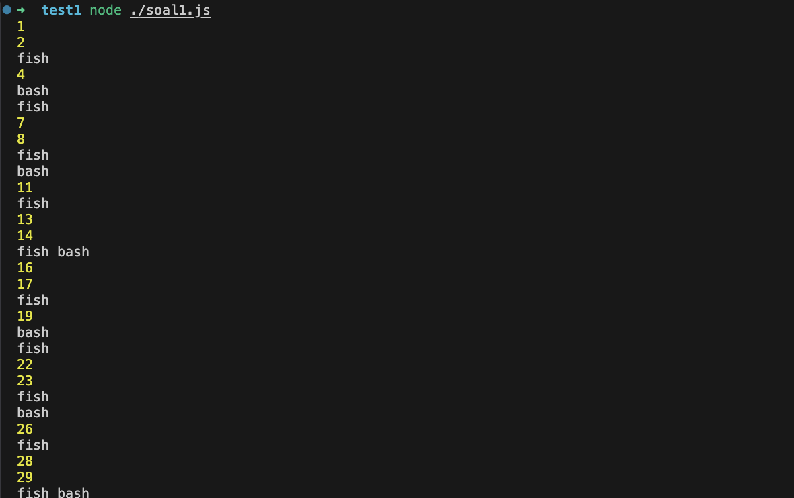
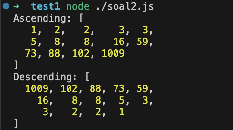
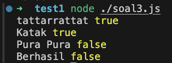

## Getting Started

1. Install Nodejs [disini](https://nodejs.org/en/download/package-manager)
2. Jalankan fungsi dengan perintah `node ./soal${nomor soal}.js`

## Example
`node ./soal1.js`

`node ./soal2.js`

`node ./soal3.js`

